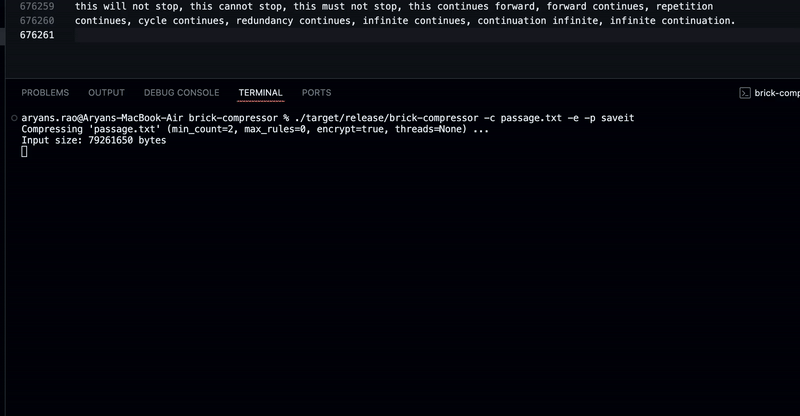
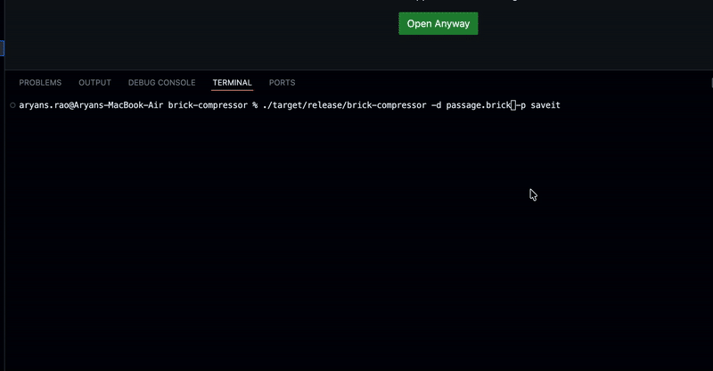

# Brick Compressor (Grammar-based)


<div style="display: flex; flex-direction: row; gap: 32px;">
	<div style="display: inline-block; text-align: center;">
		<br>
		<b>Compression Demo</b>
	</div>
	<div style="display: inline-block; text-align: center;">
		<br>
		<b>Decompression Demo</b>
	</div>
</div>

> High-performance, parallel file compressor with optional AES-256-GCM encryption, CRC32 verification, and a modern CLI. Inspired by the Re-Pair algorithm.

---

## Features

- **Re-Pair style compression**: Grammar-based, dictionary compression for high efficiency.
- **Parallelized**: Uses Rayon for multi-threaded pair counting and replacement.
- **AES-256-GCM encryption**: Optional, with passphrase-based key derivation (SHA-256).
- **CRC32 verification**: Ensures data integrity for every archive.
- **Rich CLI**: Single-line progress bar, stats, and flexible options.
- **Cross-platform**: Runs anywhere Rust does.

---

## How It Works

Brick Compressor implements a grammar-based compression algorithm inspired by [Re-Pair](https://en.wikipedia.org/wiki/Re-Pair) with several enhancements:

1. **Pair Counting**: Finds the most frequent adjacent symbol pairs in the input.
2. **Rule Creation**: Replaces the most frequent pair with a new symbol, repeating until no pair meets the minimum frequency or a rule limit is reached.
3. **Parallelism**: Both pair counting and replacement are parallelized for speed on large files.
4. **Serialization**: The compressed file stores the rules, sequence, and original filename (obfuscated), plus a CRC32 checksum.
5. **Encryption (optional)**: If enabled, the payload is encrypted with AES-256-GCM using a passphrase-derived key.

---

## Build & Install

### Prerequisites
- [Rust toolchain](https://www.rust-lang.org/tools/install)

### Build
```sh
cargo build --release
```

---

## Usage

### Compress a file
```sh
brick-compressor -c input.txt
# Output: input.brick
```

### Compress with encryption
```sh
brick-compressor -c input.txt -e -p mypassword
```

### Decompress a file
```sh
brick-compressor -d input.brick
# Output: original filename (embedded in archive)
```

### Decompress encrypted file
```sh
brick-compressor -d input.brick -p mypassword
```

### Options

- `-c <file>` / `--compress <file>`: Compress file
- `-d <file>` / `--decompress <file>`: Decompress file
- `-o <file>`: Output path (default: `<input>.brick` or embedded name)
- `-e` / `--encrypt`: Enable AES-256-GCM encryption
- `-p <pass>` / `--pass <pass>`: Passphrase for encryption/decryption
- `--min-count <N>`: Minimum pair frequency to create a rule (default: 2)
- `--max-rules <N>`: Maximum number of rules (default: unlimited)
- `--threads <N>`: Number of threads (default: all available)

---

## Encryption Details

- **Algorithm**: AES-256-GCM
- **Key Derivation**: SHA-256(passphrase)
- **Nonce**: Random 12 bytes per file
- **Integrity**: Authenticated encryption (GCM) + CRC32 for payload

---

## Progress & Performance

- **Progress bar**: Single-line, shows percent, compression ratio, speed, ETA, and more.
- **Parallelism**: Uses all available CPU cores for large files.
- **Verification**: Decompression checks CRC32 and verifies output matches original input.

---

## File Format

- **Header**: Magic bytes (`BRCK`), version, flags
- **Payload**: Compressed rules, sequence, obfuscated original filename, CRC32
- **Encryption**: If enabled, payload is encrypted with AES-256-GCM

---

## Example

```sh
# Compress with encryption and custom output
brick-compressor -c secret.txt -e -p s3cr3t -o archive.brick

# Decompress
brick-compressor -d archive.brick -p s3cr3t
```

---

## Algorithm Overview

1. **Pair Counting**: Counts all adjacent symbol pairs in parallel.
2. **Rule Selection**: Picks the most frequent pair above `--min-count`.
3. **Replacement**: Replaces all instances of the pair with a new symbol (parallel for large data).
4. **Repeat**: Continues until no pair meets the threshold or `--max-rules` is reached.
5. **Serialization**: Stores rules, sequence, and filename in a compact, CRC32-verified format.
6. **Encryption**: Optionally encrypts the payload with AES-256-GCM.

---

## Testing & Verification

- After compression, the tool automatically verifies that decompression yields the original file.
- CRC32 is checked on decompression to detect corruption.

---

## Contributing

Pull requests and issues are welcome! Please open an issue to discuss major changes.

---
